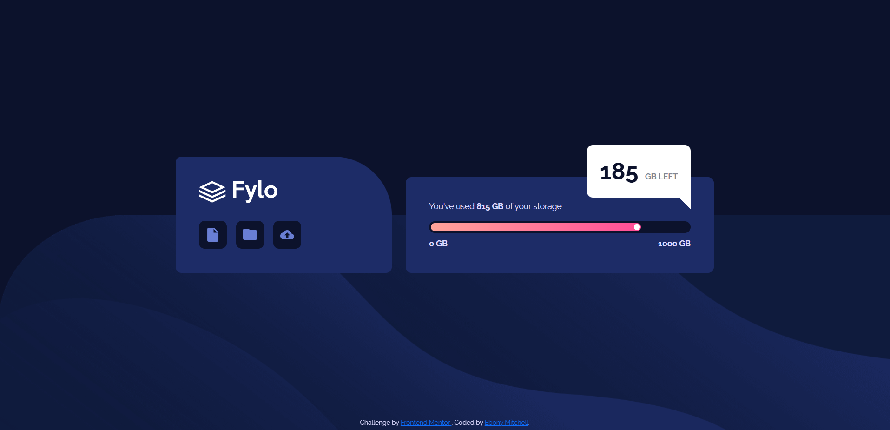

# Frontend Mentor - Fylo Data Storage Component Solution

This is my solution to the [Fylo Data Storage Component challenge on Frontend Mentor](https://www.frontendmentor.io/challenges/fylo-data-storage-component-1dZPRbV5n). The goal of this project was to recreate the provided design using HTML, CSS, and Bootstrap and make it responsive for desktop and mobile screens.

## Table of Contents

- [Overview](#overview)
  - [The Challenge](#the-challenge)
  - [Screenshot](#screenshot)
  - [Links](#links)
- [My Process](#my-process)
  - [Built With](#built-with)
  - [What I Learned](#what-i-learned)
  - [Continued Development](#continued-development)
  - [Useful Resources](#useful-resources)
  - [AI Collaboration](#ai-collaboration)
- [Reflection](#reflection)
- [Author](#author)

## Overview

### The Challenge

Users should be able to:

- View the optimal layout for the component depending on their device's screen size
- View the desktop layout with the Fylo and storage cards side by side
- View the mobile layout with the cards stacked vertically

### Screenshot



### Links

- Solution URL: https://github.com/ebonymitchell/sba-4
- Live Site URL: Add live site URL here

## My Process

I started by breaking the design into two main sections: the Fylo card and the storage card. I used Bootstrap's grid system to put the cards side by side on desktop and stack them on mobile.

Once I had the basic structure working, I used custom CSS to get closer to the actual design. That included the colors, background images, rounded corners, icon buttons, progress bar, gradient, and the 185 GB storage indicator.

I focused on getting the overall layout working first and then worked through the smaller design details.

### Built With

- Semantic HTML5
- CSS
- Bootstrap 5
- Bootstrap Grid
- Bootstrap utility classes
- Flexbox
- Media queries
- Responsive design

### What I Learned

The biggest thing I learned from this project was how Bootstrap and custom CSS can work together. I'm still getting used to figuring out what I should let Bootstrap handle and what I need to style myself.

For example, I used Bootstrap's responsive grid classes to control how the two cards behave at different screen sizes:

```html
<div class="col-12 col-md-5">
```

and

```html
<div class="col-12 col-md-7">
```

On smaller screens, both columns take up the full width and stack. At the `md` breakpoint and above, they divide the row into separate columns.

I also got more practice using custom CSS for design details that Bootstrap could not recreate exactly, especially the gradient progress bar and the storage indicator.

One thing I learned during this project is that making something responsive and making it accurately match the responsive design are not necessarily the same thing. My layout responds at different screen sizes, but I would still like to improve the proportions of the mobile version.

### Continued Development

I want to keep practicing Bootstrap until using the grid system and utility classes feels more natural. Right now, I still have to think through whether Bootstrap or custom CSS makes more sense for different parts of a design.

I also want more practice recreating responsive designs accurately. The mobile proportions were one of the harder parts of this project and are still not as close to the reference as I would like.

This project was also more difficult without access to the Figma design file. In previous projects, I was able to inspect exact measurements, spacing, sizing, border radius, and other values instead of estimating them from an image. I want to continue getting better at both working from Figma and recreating designs when those exact values are not available.

### Useful Resources

- [Bootstrap Documentation](https://getbootstrap.com/docs/5.3/getting-started/introduction/) - I used Bootstrap for the responsive grid, layout, spacing, and utility classes.
- [Frontend Mentor](https://www.frontendmentor.io/) - The challenge files and reference designs were provided by Frontend Mentor.

### AI Collaboration

### AI Collaboration

I used ChatGPT mainly as a tutor and debugging assistant to help me understand Bootstrap and troubleshoot layout issues.

I'm also working on relying less on AI as I become more comfortable with the concepts. My goal is to use it when I'm stuck or need something explained, rather than as my first step when solving a problem.

## Reflection

The biggest challenge for me on this project was Bootstrap. I'm still getting used to figuring out what I should let Bootstrap handle and what I need to do with custom CSS. I was able to use the Bootstrap grid to make the two cards sit beside each other on desktop and stack on mobile, but getting the design itself to match the reference took more work.

The mobile proportions still aren't as accurate as I would like them to be. This project was also more difficult without access to the Figma file. I've gotten used to being able to inspect exact measurements, spacing, and sizing in Figma instead of guessing from an image.

I approached the project by getting the main layout working first and then working through the individual design details. If I had more time, I would focus mostly on getting the mobile proportions closer to the original design.

## Author

- GitHub - [Ebony Mitchell](https://github.com/ebonymitchell)
- Frontend Mentor - https://www.frontendmentor.io/profile/ebonymitchell